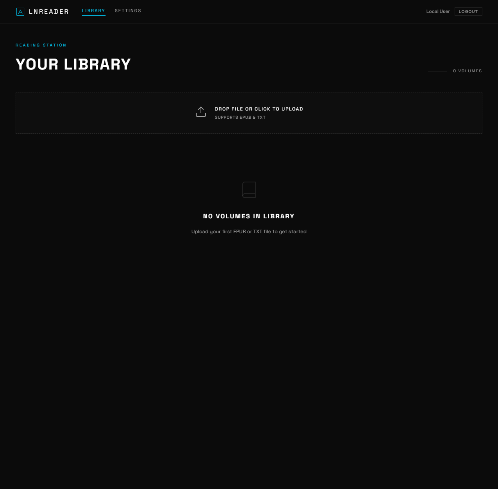
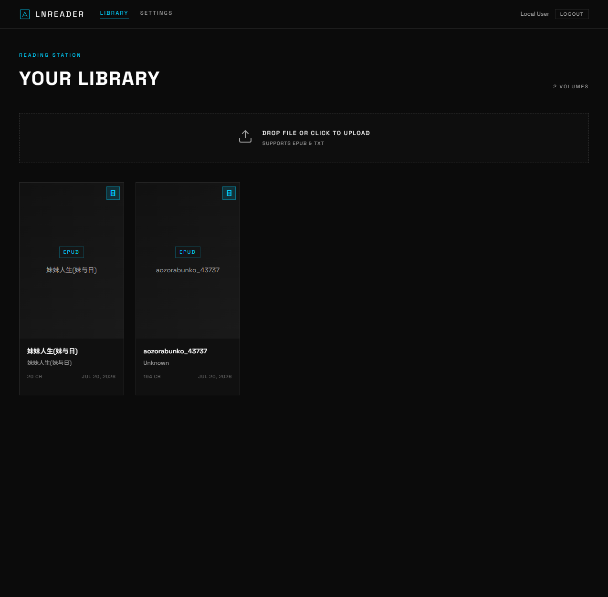
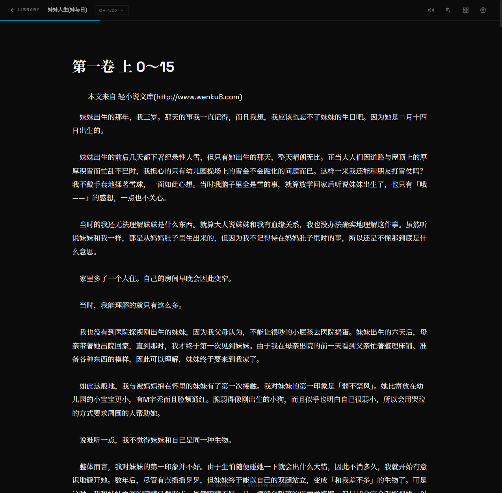
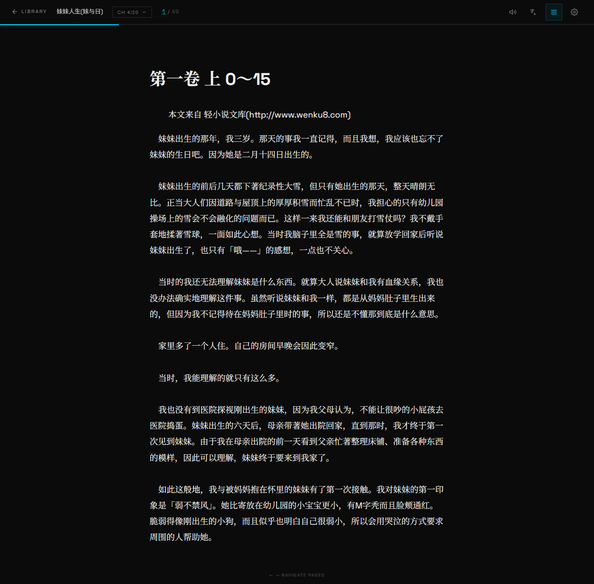
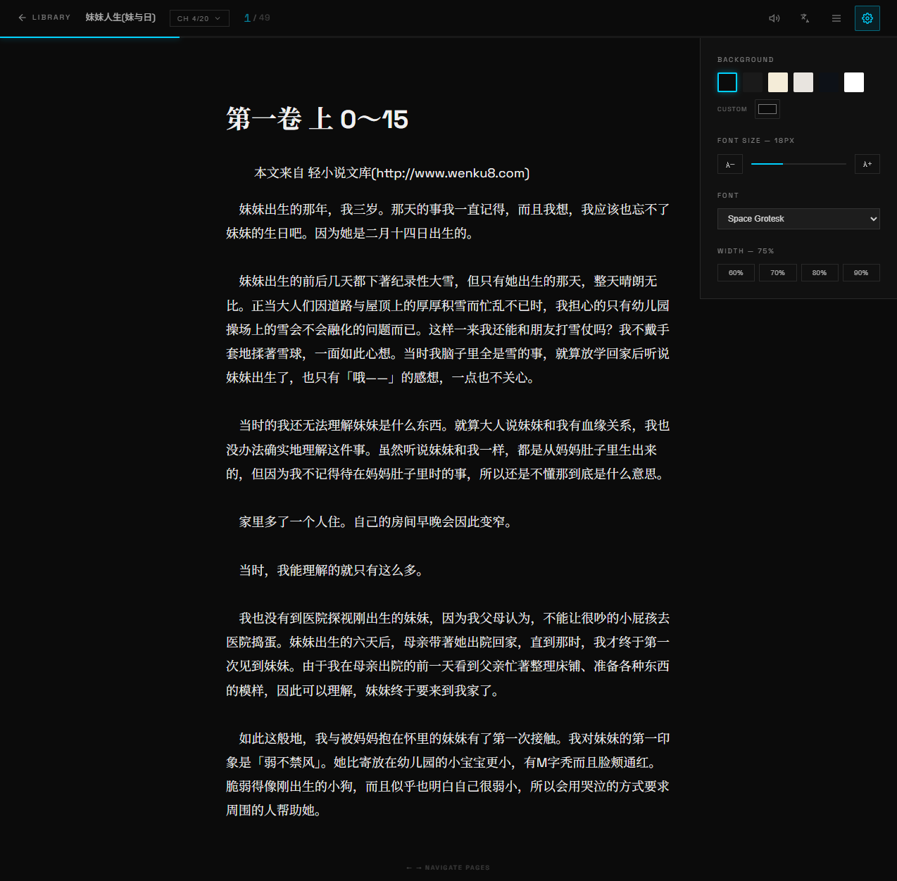
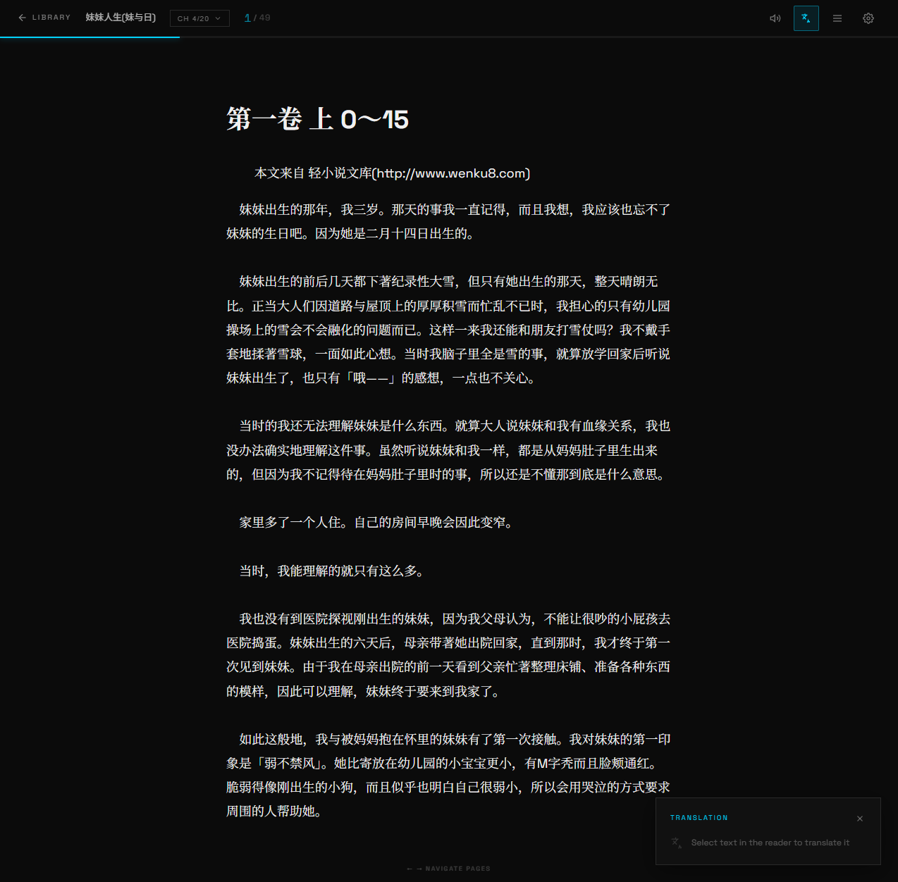
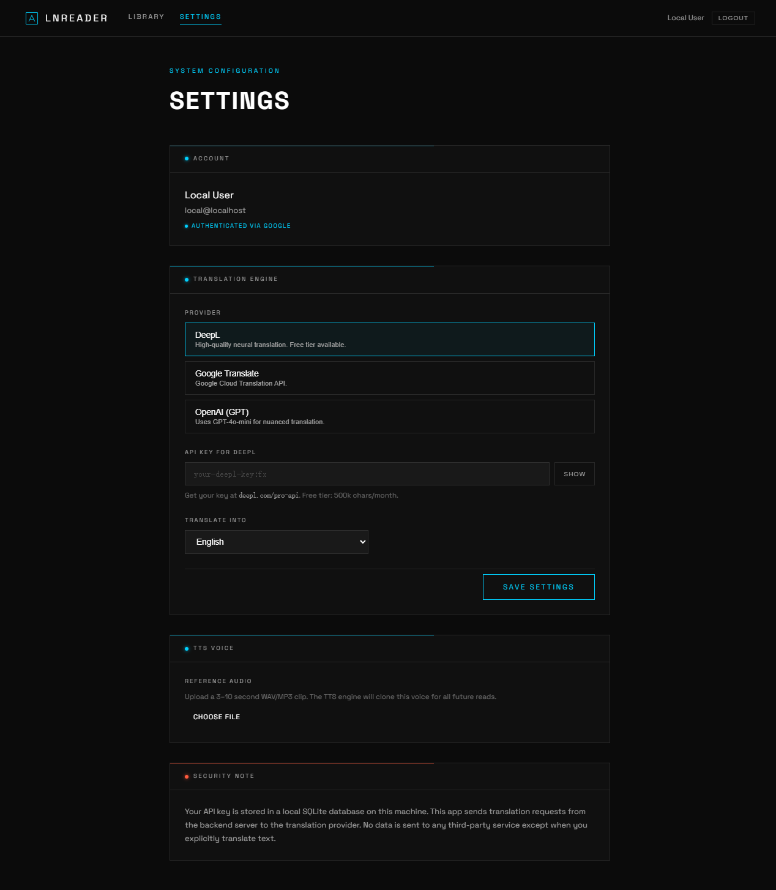
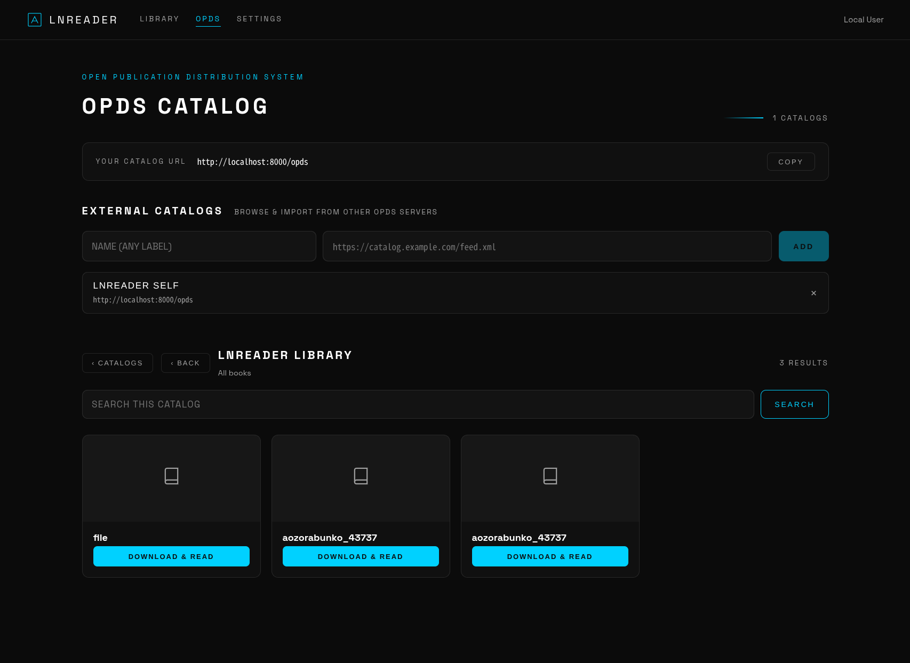

# LNreader

一个自托管的电子书阅读器，专为日式轻小说与文学阅读打造。上传 EPUB 或 TXT 文件，在浏览器中阅读，并由本地 TTS 引擎生成章节音频——全部运行在你自己的机器上。

---

## 截图

| | |
|---|---|
|  |  |
| *书库 — 空状态* | *书库 — 已上传书籍* |
|  |  |
| *阅读器 — 滚动模式* | *阅读器 — 分页模式* |
|  |  |
| *阅读器 — 显示设置* | *阅读器 — 翻译面板* |
|  | |
| *设置 — 翻译与 TTS 配置* | |
|  | |
| *OPDS — 目录浏览与外部源* | |

---

## 功能特性

### 📚 书库
- 拖拽或文件选择上传 EPUB / TXT 文件
- 书籍卡片展示封面、标题、作者、章节数与上传日期
- 支持从书库删除书籍
- 支持任意大小的书籍
- 书库页右下角**任务中心**——汇总所有后台任务（哔哩轻小说下载、章节音频生成），可展开/收起；每项显示进度条、章节计数（`12 / 620`）与 取消 / 重试 / 关闭 操作

### 🔍 搜索
- 书库页统一搜索栏——同时搜索**本地书库**（标题/作者）与 **bilinovel.com**（linovelib.com 的镜像站）
- 结果展示封面、作者、出版社、状态、评分、标签与简介；点击结果直接打开站点的小说页面
- 无需 Cookie 或配置：后端通过 Chrome TLS 指纹模拟 HTTP 客户端复现站点的 Jieqi 搜索防护流程（css/js/redeem cookies）

### 📥 从哔哩轻小说下载
- 在任意搜索结果上点击 **Download**——后端抓取小说（目录、多页章节、插图）并打包成 EPUB，然后像上传一样直接注册到你的书库
- 后台任务，结果卡片实时显示进度（`12 / 620`），可中途取消；完成后变为 **READ**

### 📡 OPDS（开放出版物分发系统）
- **OPDS 服务器**：书库以标准 OPDS 1.x 目录对外发布（`/opds`、`/opds/catalog`、`/opds/search`、`/opds/opensearch.xml`），任何 OPDS 客户端（Foliate、KOReader、Thorium…）都可浏览、搜索并下载你的书籍——书库页导航栏 →「OPDS」即可看到本机目录地址
- **OPDS 客户端**：在 `/opds` 页添加任意外部 OPDS 目录 URL，即可在应用内浏览（支持多层级子目录）、搜索，并一键 **DOWNLOAD & READ**——下载的 EPUB 直接注册进书库，自动跳转到阅读器
- 支持平铺/分页浏览、封面展示、搜索模板（`{searchTerms}` 内联或 OpenSearch 描述解析）、通用外链获取（无扩展名的 /download/123 链接按 Content-Type 识别）

### 📖 阅读器
- **滚动模式**——虚拟 DOM 窗口化，流畅阅读长文
- **分页模式**——逐页阅读，← → 键盘翻页
- 章节选择器（一键跳转任意章节）
- **显示设置**——背景色、字号、字体、页面宽度
- 阅读进度每 2 秒自动保存

### 🌐 翻译
- 在阅读器中选中任意文本，点击 **Translate**
- 支持三种服务商：**DeepL**、**Google Translate**、**OpenAI (GPT-4o-mini)**
- 在设置中配置服务商与 API 密钥

### 🔊 TTS 音频（OmniVoice / IndexTTS-2.5）
- 使用本地运行的 TTS 服务器逐章生成音频——默认 [OmniVoice](https://github.com/k2-fsa/OmniVoice)（GPU 容器，需要 NVIDIA GPU），也可选择 [IndexTTS-2.5](https://github.com/index-tts/index-tts)（零样本声音克隆，支持中/英/日/西/阿）
- TTS 容器定义在 `docker-compose.yml` 中（默认启用 `omnivoice-tts` GPU 版；备选 `omnivoice-tts-cpu` 与 `indextts-tts`）；切换引擎时注释掉不用的容器，并在后端服务上设置 `TTS_URL_BASE`
- 后台生成——书库卡片上逐章显示进度
- 专属 **听书** 页面（`/listen/:id`）：
  - 播放/暂停、进度条、倍速控制
  - 章节侧边栏显示音频可用状态
  - 播放完成自动进入下一章
  - 跨会话记住上次收听位置

### ⚙️ 设置
- 翻译服务商选择与 API 密钥存储
- TTS 语言——中文（默认）/ 英语 / 日语
- TTS 声音——上传参考 WAV/MP3 片段用于声音克隆
- OmniVoice 服务器地址、端口、语音配置、语言、模型大小

### 🔐 认证
- **本地开发模式**——点击 *Continue Locally* 获得零配置 JWT 会话

---

## 环境要求

| 要求 | 说明 |
|---|---|
| [Docker](https://docs.docker.com/get-docker/) + [Docker Compose](https://docs.docker.com/compose/) | 建议 v2.20+ |
| NVIDIA GPU + [nvidia-container-toolkit](https://docs.nvidia.com/datacenter/cloud-native/container-toolkit/install-guide.html) | 可选——仅在启用 TTS 容器 GPU 模式时需要（默认 CPU 模式） |
| `backend/` 下的 `.env` 文件 | 见下表 |

---

## 快速开始

```bash
# 1. 克隆仓库
git clone https://github.com/youruser/lnreader.git
cd lnreader

# 2. 创建 backend/.env（见下表）
cp backend/.env.example backend/.env   # 或手动创建

# 3. 构建并启动所有服务
docker compose up --build -d

# 4. 浏览器打开
open http://localhost:8080
```

> 首次启动会下载约 2 GB 的 CUDA/TTS 依赖。后续启动使用缓存层，速度很快。

---

## 环境变量

创建 `backend/.env`，包含以下内容：

| 变量 | 必填 | 默认值 | 说明 |
|---|---|---|---|
| `JWT_SECRET` | **是** | — | 用于签名 JWT 的随机字符串，请使用长随机值 |
| `GOOGLE_CLIENT_ID` | 仅 OAuth | — | Google OAuth 应用客户端 ID |
| `GOOGLE_CLIENT_SECRET` | 仅 OAuth | — | Google OAuth 应用客户端密钥 |
| `FRONTEND_URL` | 否 | `http://localhost` | CORS 来源与 OAuth 重定向基地址 |
| `BACKEND_URL` | 否 | `http://localhost:8000` | OAuth 回调 URI 基地址 |
| `BOOKS_DIR` | 否 | `/app/books` | 容器内 EPUB 存储路径 |
| `AUDIO_DIR` | 否 | `/app/audio` | 容器内生成 WAV 文件的路径 |
| `DATABASE_URL` | 否 | `sqlite:////app/data/lnreader.db` | SQLAlchemy 数据库地址 |
| `TTS_URL_BASE` | 否 | `http://lnreader-omnivoice-tts:8765` | TTS 服务器地址（在 `docker-compose.yml` 中设置；OmniVoice CPU 为 `http://lnreader-omnivoice-tts-cpu:8767`，IndexTTS-2.5 为 `http://lnreader-indextts-tts:8766`） |

**本地开发最小 `.env`（不使用 Google OAuth）：**
```env
JWT_SECRET=change-me-to-a-random-string
```

---

## 服务与端口

| 服务 | 主机端口 | 说明 |
|---|---|---|
| `lnreader-frontend` | **8080** | nginx 托管的 Angular 应用 |
| `lnreader-backend` | 内部 | FastAPI——仅可通过 nginx 反代访问 |
| `lnreader-omnivoice-tts` | 内部 | OmniVoice TTS API（GPU，需 NVIDIA GPU + nvidia-container-toolkit）——仅后端经 `app-net` 访问 |
| `lnreader-omnivoice-tts-cpu` | 内部 | OmniVoice TTS API（CPU，无需 GPU）——默认注释 |
| `lnreader-indextts-tts` | 内部 | IndexTTS-2.5 TTS API——默认注释（CPU 或 GPU 可选） |

---

## 技术栈

| 层 | 技术 |
|---|---|
| 前端 | Angular 21、Signals、RxJS、TypeScript |
| 后端 | FastAPI、SQLAlchemy 2、SQLite |
| TTS | OmniVoice 或 IndexTTS-2.5（Hugging Face） |
| 基础设施 | Docker Compose、nginx |

---

## 致谢

- [bili_novel_packer](https://github.com/montaro2017/bili_novel_packer) —— bilinovel.com 抓取策略的参考实现（限速、目录解析、章节链接探测、段落乱序还原）
- [OmniVoice](https://github.com/k2-fsa/OmniVoice) —— 提供章节音频的 TTS 引擎
- [IndexTTS-2.5](https://github.com/index-tts/index-tts) —— 支持零样本声音克隆的备用 TTS 引擎

---

## 许可证

本项目基于 **GNU General Public License v3.0 (GPL-3.0)** 开源发布——详见 [LICENSE](LICENSE)。

你可以自由使用、修改与分发本项目，但任何衍生作品必须以 GPL-3.0 许可发布，并保留版权声明与许可文本。

---

## 停止 / 重置

```bash
# 停止但不删除数据
docker compose down

# 停止并清空所有数据（书籍、数据库、音频）
docker compose down -v
```

---

## 开发

不使用 Docker 的本地开发方式：

```bash
# 后端
cd backend
pip install -r requirements.txt
uvicorn main:app --reload --port 8000

# 前端（另开终端）
cd frontend
npm install
npm start   # 将 /api/* 与 /auth/* 代理到 localhost:8000
```

前端开发服务器：`http://localhost:4200`
